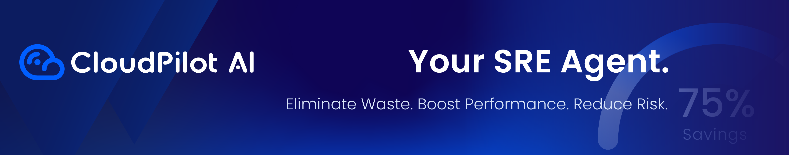

  

    
  

At [CloudPilot AI](https://cloudpilot.ai), we are committed to integrating cloud-native, open-source, and AI technologies to develop a resilient and cost-effective infrastructure automation platform. This platform maximizes the value of every dollar a company invests in the cloud. Our core code is open-source and freely accessible to everyone.

## Projects
We welcome contributions to the following projects:
* [karpenter-core](https://github.com/kubernetes-sigs/karpenter): Karpenter core code.
* [karpenter-provider-alibabacloud](https://github.com/cloudpilot-ai/karpenter-provider-alibabacloud): Alibaba Cloud Karpenter Provider.
* [karpenter-provider-gcp](https://github.com/cloudpilot-ai/karpenter-provider-gcp): Google Cloud Karpenter Provider.
* [karpenter-provider-aws](https://github.com/aws/karpenter-provider-aws): AWS Karpenter Provider.
* [karpenter-provider-azure](https://github.com/Azure/karpenter-provider-azure): Azure Karpenter Provider.
* [karpenter-provider-tke](https://github.com/TencentCloud/karpenter-provider-tke): Tencent Cloud Karpenter Provider.

We also offer a tool to analyze spot insights across different cloud providers. Visit [spot.cloudpilot.ai](https://spot.cloudpilot.ai) for more details.

## Connect with us

If you have any questions, please reach out to us through the following channels:
- [Slack about CloudPilot AI](https://join.slack.com/t/cloudpilotaicommunity/shared_invite/zt-37rwpf8k7-Rx4BjrhuWtk9U0MXBKYL7A)
- [Slack about Karpenter](https://cloudpilotaicommunity.slack.com/archives/C093V65481H)

## Work with us
If you choose to contribute to any of our projects, we would love to work with you and help hone your PRs to near perfection.
